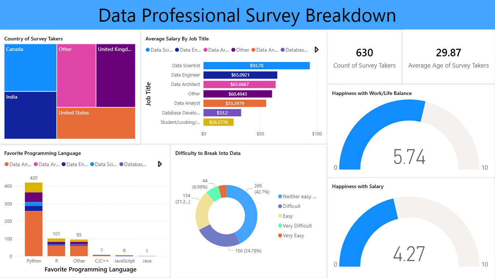
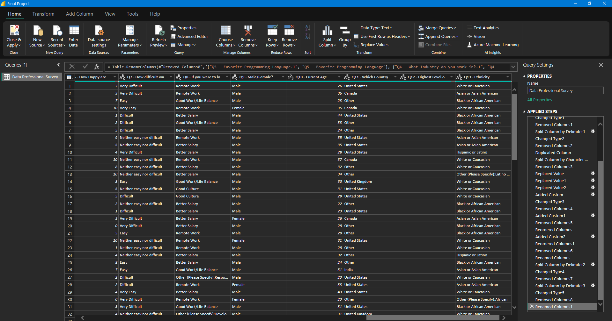

# 🚀 Power BI Project: Data Professional Survey Analysis

## 📌 Project Overview
This project is a technical demonstration of end-to-end data analysis. The focus was on taking a raw, messy survey dataset and performing extensive **ETL (Extract, Transform, Load)** to build a professional-grade dashboard.

---

## 🖼️ Dashboard Preview
The final report features dynamic filtering and KPI tracking for a global view of the data industry.

*Figure 1: Final Interactive Dashboard showing global career insights.*

---

## 🛠️ Technical Deep Dive

### 1. Data Cleaning & Refinement (The Power Query Stage)
The raw survey data contained many inconsistencies. I performed the following refinements to ensure data quality:
* **Standardizing Columns:** Fixed inconsistent naming in "Job Titles" and "Industries" (e.g., merging similar "Other" categories).
* **Salary Normalization:** Transformed text-based ranges (like "$100k-125k") into clean, numerical formats for accurate calculation.
* **Geospatial Correction:** Cleaned country names to ensure 100% accuracy in map visualizations.
* **Handling Nulls:** Applied logic to manage missing values without compromising the integrity of the survey results.

*Figure 2: Table View showing the cleaned and structured data after transformation.*

### 2. Modeling & Analytics
* **DAX Measures:** Developed custom measures to calculate average satisfaction scores and respondent distributions.
* **Interactivity:** Integrated slicers and bookmarks to allow users to pivot between different job roles and experience levels.

## 📂 Project Structure
* `Final Project.pbix`: The complete Power BI project file (including Power Query steps).
* `Data/`: The original and refined survey dataset.
* `Screenshots/`: Visual documentation of the project.

## 🚀 How to Explore
1. Clone the repo.
2. Open `Final Project.pbix` in **Power BI Desktop**.
3. Go to the **Transform Data** section to see the specific cleaning steps applied to each column.

---
**Developed by:** AliBinary
